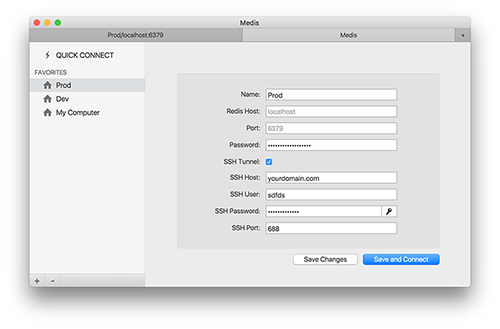

[](https://github.com/luin/ioredis)

[](https://travis-ci.org/luin/ioredis)
[](https://codeclimate.com/github/luin/ioredis)
[](https://github.com/prettier/prettier)
[](https://gitter.im/luin/ioredis?utm_source=badge&utm_medium=badge&utm_campaign=pr-badge&utm_content=badge)
[](http://commitizen.github.io/cz-cli/)
[](https://github.com/semantic-release/semantic-release)
[](https://www.npmjs.com/package/ioredis)
[](https://www.npmjs.com/package/ioredis)


A robust, performance-focused and full-featured [Redis](http://redis.io) client for [Node.js](https://nodejs.org).

Supports Redis >= 2.6.12 and (Node.js >= 6).

# Features

ioredis is a robust, full-featured Redis client that is
used in the world's biggest online commerce company [Alibaba](http://www.alibaba.com/) and many other awesome companies.

0. Full-featured. It supports [Cluster](http://redis.io/topics/cluster-tutorial), [Sentinel](http://redis.io/topics/sentinel), [Pipelining](http://redis.io/topics/pipelining) and of course [Lua scripting](http://redis.io/commands/eval) & [Pub/Sub](http://redis.io/topics/pubsub) (with the support of binary messages).
1. High performance.
2. Delightful API. It works with Node callbacks and Native promises.
3. Transformation of command arguments and replies.
4. Transparent key prefixing.
5. Abstraction for Lua scripting, allowing you to define custom commands.
6. Support for binary data.
7. Support for TLS.
8. Support for offline queue and ready checking.
9. Support for ES6 types, such as `Map` and `Set`.
10. Support for GEO commands (Redis 3.2 Unstable).
11. Sophisticated error handling strategy.
12. Support for NAT mapping.

# Links

- [API Documentation](API.md)
- [Changelog](Changelog.md)
- [Migrating from node_redis](https://github.com/luin/ioredis/wiki/Migrating-from-node_redis)
- [Error Handling](#error-handling)

<hr>
<a href="http://bit.ly/medis-macos"></a>

### [AD] Medis: Redis GUI for OS X

Looking for a Redis GUI manager for OS X, Windows and Linux? Here's [Medis](http://bit.ly/medis-macos)!

Medis is an open-sourced, beautiful, easy-to-use Redis GUI management application.

Medis starts with all the basic features you need:

- Keys viewing/editing
- SSH Tunnel for connecting with remote servers
- Terminal for executing custom commands
- JSON/MessagePack format viewing/editing and built-in highlighting/validator
- And other awesome features...

[Medis is open sourced on GitHub](https://github.com/luin/medis)

### [AD] Kuber: Kubernetes Dashboard for iOS

<a href="http://bit.ly/kuber-ios"></a>

<hr>

# Quick Start

## Install

```shell
$ npm install ioredis
```

## Basic Usage

```javascript
const Redis = require("ioredis");
const redis = new Redis(); // uses defaults unless given configuration object

// ioredis supports all Redis commands:
redis.set("foo", "bar"); // returns promise which resolves to string, "OK"

// the format is: redis[SOME_REDIS_COMMAND_IN_LOWERCASE](ARGUMENTS_ARE_JOINED_INTO_COMMAND_STRING)
// the js: ` redis.set("mykey", "Hello") ` is equivalent to the cli: ` redis> SET mykey "Hello" `

// ioredis supports the node.js callback style
redis.get("foo", function(err, result) {
  if (err) {
    console.error(err);
  } else {
    console.log(result); // Promise resolves to "bar"
  }
});

// Or ioredis returns a promise if the last argument isn't a function
redis.get("foo").then(function(result) {
  console.log(result); // Prints "bar"
});

// Most responses are strings, or arrays of strings
redis.zadd("sortedSet", 1, "one", 2, "dos", 4, "quatro", 3, "three")
redis.zrange("sortedSet", 0, 2, "WITHSCORES").then(res => console.log(res)); // Promise resolves to ["one", "1", "dos", "2", "three", "3"] as if the command was ` redis> ZRANGE sortedSet 0 2 WITHSCORES `

// All arguments are passed directly to the redis server:
redis.set("key", 100, "EX", 10);
```

See the `examples/` folder for more examples.

## Connect to Redis

When a new `Redis` instance is created,
a connection to Redis will be created at the same time.
You can specify which Redis to connect to by:

```javascript
new Redis(); // Connect to 127.0.0.1:6379
new Redis(6380); // 127.0.0.1:6380
new Redis(6379, "192.168.1.1"); // 192.168.1.1:6379
new Redis("/tmp/redis.sock");
new Redis({
  port: 6379, // Redis port
  host: "127.0.0.1", // Redis host
  family: 4, // 4 (IPv4) or 6 (IPv6)
  password: "auth",
  db: 0
});
```

You can also specify connection options as a [`redis://` URL](http://www.iana.org/assignments/uri-schemes/prov/redis) or [`rediss://` URL](https://www.iana.org/assignments/uri-schemes/prov/rediss) when using [TLS encryption](#tls-options):

```javascript
// Connect to 127.0.0.1:6380, db 4, using password "authpassword":
new Redis("redis://:authpassword@127.0.0.1:6380/4");
```

See [API Documentation](API.md#new_Redis) for all available options.

## Pub/Sub

Here is a simple example of the API for publish/subscribe.
The following program opens two client connections.
It subscribes to a channel with one connection
and publishes to that channel with the other:

```javascript
var Redis = require("ioredis");
var redis = new Redis();
var pub = new Redis();
redis.subscribe("news", "music", function(err, count) {
  // Now we are subscribed to both the 'news' and 'music' channels.
  // `count` represents the number of channels we are currently subscribed to.

  pub.publish("news", "Hello world!");
  pub.publish("music", "Hello again!");
});

redis.on("message", function(channel, message) {
  // Receive message Hello world! from channel news
  // Receive message Hello again! from channel music
  console.log("Receive message %s from channel %s", message, channel);
});

// There's also an event called 'messageBuffer', which is the same as 'message' except
// it returns buffers instead of strings.
redis.on("messageBuffer", function(channel, message) {
  // Both `channel` and `message` are buffers.
});
```

`PSUBSCRIBE` is also supported in a similar way:

```javascript
redis.psubscribe("pat?ern", function(err, count) {});
redis.on("pmessage", function(pattern, channel, message) {});
redis.on("pmessageBuffer", function(pattern, channel, message) {});
```

When a client issues a SUBSCRIBE or PSUBSCRIBE, that connection is put into a "subscriber" mode.
At that point, only commands that modify the subscription set are valid.
When the subscription set is empty, the connection is put back into regular mode.

If you need to send regular commands to Redis while in subscriber mode, just open another connection.

## Handle Binary Data

Arguments can be buffers:

```javascript
redis.set("foo", Buffer.from("bar"));
```

And every command has a method that returns a Buffer (by adding a suffix of "Buffer" to the command name).
To get a buffer instead of a utf8 string:

```javascript
redis.getBuffer("foo", function(err, result) {
  // result is a buffer.
});
```

## Pipelining

If you want to send a batch of commands (e.g. > 5), you can use pipelining to queue
the commands in memory and then send them to Redis all at once. This way the performance improves by 50%~300% (See [benchmark section](#benchmark)).

`redis.pipeline()` creates a `Pipeline` instance. You can call any Redis
commands on it just like the `Redis` instance. The commands are queued in memory
and flushed to Redis by calling the `exec` method:

```javascript
var pipeline = redis.pipeline();
pipeline.set("foo", "bar");
pipeline.del("cc");
pipeline.exec(function(err, results) {
  // `err` is always null, and `results` is an array of responses
  // corresponding to the sequence of queued commands.
  // Each response follows the format `[err, result]`.
});

// You can even chain the commands:
redis
  .pipeline()
  .set("foo", "bar")
  .del("cc")
  .exec(function(err, results) {});

// `exec` also returns a Promise:
var promise = redis
  .pipeline()
  .set("foo", "bar")
  .get("foo")
  .exec();
promise.then(function(result) {
  // result === [[null, 'OK'], [null, 'bar']]
});
```

Each chained command can also have a callback, which will be invoked when the command
gets a reply:

```javascript
redis
  .pipeline()
  .set("foo", "bar")
  .get("foo", function(err, result) {
    // result === 'bar'
  })
  .exec(function(err, result) {
    // result[1][1] === 'bar'
  });
```

In addition to adding commands to the `pipeline` queue individually, you can also pass an array of commands and arguments to the constructor:

```javascript
redis.pipeline([["set", "foo", "bar"], ["get", "foo"]]).exec(function() {
  /* ... */
});
```

`#length` property shows how many commands in the pipeline:

```javascript
const length = redis
  .pipeline()
  .set("foo", "bar")
  .get("foo").length;
// length === 2
```

## Transaction

Most of the time, the transaction commands `multi` & `exec` are used together with pipeline.
Therefore, when `multi` is called, a `Pipeline` instance is created automatically by default,
so you can use `multi` just like `pipeline`:

```javascript
redis
  .multi()
  .set("foo", "bar")
  .get("foo")
  .exec(function(err, results) {
    // results === [[null, 'OK'], [null, 'bar']]
  });
```

If there's a syntax error in the transaction's command chain (e.g. wrong number of arguments, wrong command name, etc),
then none of the commands would be executed, and an error is returned:

```javascript
redis
  .multi()
  .set("foo")
  .set("foo", "new value")
  .exec(function(err, results) {
    // err:
    //  { [ReplyError: EXECABORT Transaction discarded because of previous errors.]
    //    name: 'ReplyError',
    //    message: 'EXECABORT Transaction discarded because of previous errors.',
    //    command: { name: 'exec', args: [] },
    //    previousErrors:
    //     [ { [ReplyError: ERR wrong number of arguments for 'set' command]
    //         name: 'ReplyError',
    //         message: 'ERR wrong number of arguments for \'set\' command',
    //         command: [Object] } ] }
  });
```

In terms of the interface, `multi` differs from `pipeline` in that when specifying a callback
to each chained command, the queueing state is passed to the callback instead of the result of the command:

```javascript
redis
  .multi()
  .set("foo", "bar", function(err, result) {
    // result === 'QUEUED'
  })
  .exec(/* ... */);
```

If you want to use transaction without pipeline, pass `{ pipeline: false }` to `multi`,
and every command will be sent to Redis immediately without waiting for an `exec` invocation:

```javascript
redis.multi({ pipeline: false });
redis.set("foo", "bar");
redis.get("foo");
redis.exec(function(err, result) {
  // result === [[null, 'OK'], [null, 'bar']]
});
```

The constructor of `multi` also accepts a batch of commands:

```javascript
redis.multi([["set", "foo", "bar"], ["get", "foo"]]).exec(function() {
  /* ... */
});
```

Inline transactions are supported by pipeline, which means you can group a subset of commands
in the pipeline into a transaction:

```javascript
redis
  .pipeline()
  .get("foo")
  .multi()
  .set("foo", "bar")
  .get("foo")
  .exec()
  .get("foo")
  .exec();
```

## Lua Scripting

ioredis supports all of the scripting commands such as `EVAL`, `EVALSHA` and `SCRIPT`.
However, it's tedious to use in real world scenarios since developers have to take
care of script caching and to detect when to use `EVAL` and when to use `EVALSHA`.
ioredis exposes a `defineCommand` method to make scripting much easier to use:

```javascript
var redis = new Redis();

// This will define a command echo:
redis.defineCommand("echo", {
  numberOfKeys: 2,
  lua: "return {KEYS[1],KEYS[2],ARGV[1],ARGV[2]}"
});

// Now `echo` can be used just like any other ordinary command,
// and ioredis will try to use `EVALSHA` internally when possible for better performance.
redis.echo("k1", "k2", "a1", "a2", function(err, result) {
  // result === ['k1', 'k2', 'a1', 'a2']
});

// `echoBuffer` is also defined automatically to return buffers instead of strings:
redis.echoBuffer("k1", "k2", "a1", "a2", function(err, result) {
  // result[0] equals to Buffer.from('k1');
});

// And of course it works with pipeline:
redis
  .pipeline()
  .set("foo", "bar")
  .echo("k1", "k2", "a1", "a2")
  .exec();
```

If the number of keys can't be determined when defining a command, you can
omit the `numberOfKeys` property and pass the number of keys as the first argument
when you call the command:

```javascript
redis.defineCommand("echoDynamicKeyNumber", {
  lua: "return {KEYS[1],KEYS[2],ARGV[1],ARGV[2]}"
});

// Now you have to pass the number of keys as the first argument every time
// you invoke the `echoDynamicKeyNumber` command:
redis.echoDynamicKeyNumber(2, "k1", "k2", "a1", "a2", function(err, result) {
  // result === ['k1', 'k2', 'a1', 'a2']
});
```

## Transparent Key Prefixing

This feature allows you to specify a string that will automatically be prepended
to all the keys in a command, which makes it easier to manage your key
namespaces.

**Warning** This feature won't apply to commands like [KEYS](http://redis.io/commands/KEYS) and [SCAN](http://redis.io/commands/scan) that take patterns rather than actual keys([#239](https://github.com/luin/ioredis/issues/239)),
and this feature also won't apply to the replies of commands even they are key names ([#325](https://github.com/luin/ioredis/issues/325)).

```javascript
var fooRedis = new Redis({ keyPrefix: "foo:" });
fooRedis.set("bar", "baz"); // Actually sends SET foo:bar baz

fooRedis.defineCommand("echo", {
  numberOfKeys: 2,
  lua: "return {KEYS[1],KEYS[2],ARGV[1],ARGV[2]}"
});

// Works well with pipelining/transaction
fooRedis
  .pipeline()
  // Sends SORT foo:list BY foo:weight_*->fieldname
  .sort("list", "BY", "weight_*->fieldname")
  // Supports custom commands
  // Sends EVALSHA xxx foo:k1 foo:k2 a1 a2
  .echo("k1", "k2", "a1", "a2")
  .exec();
```

## Transforming Arguments & Replies

Most Redis commands take one or more Strings as arguments,
and replies are sent back as a single String or an Array of Strings. However, sometimes
you may want something different. For instance, it would be more convenient if the `HGETALL`
command returns a hash (e.g. `{ key: val1, key2: v2 }`) rather than an array of key values (e.g. `[key1, val1, key2, val2]`).

ioredis has a flexible system for transforming arguments and replies. There are two types
of transformers, argument transformer and reply transformer:

```javascript
var Redis = require("ioredis");

// Here's the built-in argument transformer converting
// hmset('key', { k1: 'v1', k2: 'v2' })
// or
// hmset('key', new Map([['k1', 'v1'], ['k2', 'v2']]))
// into
// hmset('key', 'k1', 'v1', 'k2', 'v2')
Redis.Command.setArgumentTransformer("hmset", function(args) {
  if (args.length === 2) {
    if (typeof Map !== "undefined" && args[1] instanceof Map) {
      // utils is a internal module of ioredis
      return [args[0]].concat(utils.convertMapToArray(args[1]));
    }
    if (typeof args[1] === "object" && args[1] !== null) {
      return [args[0]].concat(utils.convertObjectToArray(args[1]));
    }
  }
  return args;
});

// Here's the built-in reply transformer converting the HGETALL reply
// ['k1', 'v1', 'k2', 'v2']
// into
// { k1: 'v1', 'k2': 'v2' }
Redis.Command.setReplyTransformer("hgetall", function(result) {
  if (Array.isArray(result)) {
    var obj = {};
    for (var i = 0; i < result.length; i += 2) {
      obj[result[i]] = result[i + 1];
    }
    return obj;
  }
  return result;
});
```

There are three built-in transformers, two argument transformers for `hmset` & `mset` and
a reply transformer for `hgetall`. Transformers for `hmset` and `hgetall` were mentioned
above, and the transformer for `mset` is similar to the one for `hmset`:

```javascript
redis.mset({ k1: "v1", k2: "v2" });
redis.get("k1", function(err, result) {
  // result === 'v1';
});

redis.mset(new Map([["k3", "v3"], ["k4", "v4"]]));
redis.get("k3", function(err, result) {
  // result === 'v3';
});
```

Another useful example of a reply transformer is one that changes `hgetall` to return array of arrays instead of objects which avoids a unwanted conversation of hash keys to strings when dealing with binary hash keys:

```javascript
Redis.Command.setReplyTransformer("hgetall", function(result) {
  var arr = [];
  for (var i = 0; i < result.length; i += 2) {
    arr.push([result[i], result[i + 1]]);
  }
  return arr;
});
redis.hset("h1", Buffer.from([0x01]), Buffer.from([0x02]));
redis.hset("h1", Buffer.from([0x03]), Buffer.from([0x04]));
redis.hgetallBuffer("h1", function(err, result) {
  // result === [ [ <Buffer 01>, <Buffer 02> ], [ <Buffer 03>, <Buffer 04> ] ];
});
```

## Monitor

Redis supports the MONITOR command,
which lets you see all commands received by the Redis server across all client connections,
including from other client libraries and other computers.

The `monitor` method returns a monitor instance.
After you send the MONITOR command, no other commands are valid on that connection. ioredis will emit a monitor event for every new monitor message that comes across.
The callback for the monitor event takes a timestamp from the Redis server and an array of command arguments.

Here is a simple example:

```javascript
redis.monitor(function(err, monitor) {
  monitor.on("monitor", function(time, args, source, database) {});
});
```
Here is another example illustrating an `async` function and `monitor.disconnect()`:
```javascript
async () => {
  const monitor = await redis.monitor()
  monitor.on('monitor', console.log)
  // Any other tasks
  monitor.disconnect()
}
```
## Streamify Scanning

Redis 2.8 added the `SCAN` command to incrementally iterate through the keys in the database. It's different from `KEYS` in that
`SCAN` only returns a small number of elements each call, so it can be used in production without the downside
of blocking the server for a long time. However, it requires recording the cursor on the client side each time
the `SCAN` command is called in order to iterate through all the keys correctly. Since it's a relatively common use case, ioredis
provides a streaming interface for the `SCAN` command to make things much easier. A readable stream can be created by calling `scanStream`:

```javascript
var redis = new Redis();
// Create a readable stream (object mode)
var stream = redis.scanStream();
stream.on("data", function(resultKeys) {
  // `resultKeys` is an array of strings representing key names.
  // Note that resultKeys may contain 0 keys, and that it will sometimes
  // contain duplicates due to SCAN's implementation in Redis.
  for (var i = 0; i < resultKeys.length; i++) {
    console.log(resultKeys[i]);
  }
});
stream.on("end", function() {
  console.log("all keys have been visited");
});
```

`scanStream` accepts an option, with which you can specify the `MATCH` pattern and the `COUNT` argument:

```javascript
var stream = redis.scanStream({
  // only returns keys following the pattern of `user:*`
  match: "user:*",
  // returns approximately 100 elements per call
  count: 100
});
```

Just like other commands, `scanStream` has a binary version `scanBufferStream`, which returns an array of buffers. It's useful when
the key names are not utf8 strings.

There are also `hscanStream`, `zscanStream` and `sscanStream` to iterate through elements in a hash, zset and set. The interface of each is
similar to `scanStream` except the first argument is the key name:

```javascript
var stream = redis.hscanStream("myhash", {
  match: "age:??"
});
```

You can learn more from the [Redis documentation](http://redis.io/commands/scan).

**Useful Tips**
It's pretty common that doing an async task in the `data` handler. We'd like the scanning process to be paused until the async task to be finished. `Stream#pause()` and `Stream.resume()` do the trick. For example if we want to migrate data in Redis to MySQL:

```javascript
var stream = redis.scanStream();
stream.on("data", function(resultKeys) {
  // Pause the stream from scanning more keys until we've migrated the current keys.
  stream.pause();

  Promise.all(resultKeys.map(migrateKeyToMySQL)).then(() => {
    // Resume the stream here.
    stream.resume();
  });
});

stream.on("end", function() {
  console.log("done migration");
});
```

## Auto-reconnect

By default, ioredis will try to reconnect when the connection to Redis is lost
except when the connection is closed manually by `redis.disconnect()` or `redis.quit()`.

It's very flexible to control how long to wait to reconnect after disconnection
using the `retryStrategy` option:

```javascript
var redis = new Redis({
  // This is the default value of `retryStrategy`
  retryStrategy: function(times) {
    var delay = Math.min(times * 50, 2000);
    return delay;
  }
});
```

`retryStrategy` is a function that will be called when the connection is lost.
The argument `times` means this is the nth reconnection being made and
the return value represents how long (in ms) to wait to reconnect. When the
return value isn't a number, ioredis will stop trying to reconnect, and the connection
will be lost forever if the user doesn't call `redis.connect()` manually.

When reconnected, the client will auto subscribe to channels that the previous connection subscribed to.
This behavior can be disabled by setting the `autoResubscribe` option to `false`.

And if the previous connection has some unfulfilled commands (most likely blocking commands such as `brpop` and `blpop`),
the client will resend them when reconnected. This behavior can be disabled by setting the `autoResendUnfulfilledCommands` option to `false`.

By default, all pending commands will be flushed with an error every 20 retry attempts. That makes sure commands won't wait forever when the connection is down. You can change this behavior by setting `maxRetriesPerRequest`:

```javascript
var redis = new Redis({
  maxRetriesPerRequest: 1
});
```

Set maxRetriesPerRequest to `null` to disable this behavior, and every command will wait forever until the connection is alive again (which is the default behavior before ioredis v4).

### Reconnect on error

Besides auto-reconnect when the connection is closed, ioredis supports reconnecting on the specified errors by the `reconnectOnError` option. Here's an example that will reconnect when receiving `READONLY` error:

```javascript
var redis = new Redis({
  reconnectOnError: function(err) {
    var targetError = "READONLY";
    if (err.message.slice(0, targetError.length) === targetError) {
      // Only reconnect when the error starts with "READONLY"
      return true; // or `return 1;`
    }
  }
});
```

This feature is useful when using Amazon ElastiCache. Once failover happens, Amazon ElastiCache will switch the master we currently connected with to a slave, leading to the following writes fails with the error `READONLY`. Using `reconnectOnError`, we can force the connection to reconnect on this error in order to connect to the new master.

Furthermore, if the `reconnectOnError` returns `2`, ioredis will resend the failed command after reconnecting.

## Connection Events

The Redis instance will emit some events about the state of the connection to the Redis server.

| Event        | Description                                                                                                                                                                                                                                     |
| :----------- | :---------------------------------------------------------------------------------------------------------------------------------------------------------------------------------------------------------------------------------------------- |
| connect      | emits when a connection is established to the Redis server.                                                                                                                                                                                     |
| ready        | If `enableReadyCheck` is `true`, client will emit `ready` when the server reports that it is ready to receive commands (e.g. finish loading data from disk).<br>Otherwise, `ready` will be emitted immediately right after the `connect` event. |
| error        | emits when an error occurs while connecting.<br>However, ioredis emits all `error` events silently (only emits when there's at least one listener) so that your application won't crash if you're not listening to the `error` event.           |
| close        | emits when an established Redis server connection has closed.                                                                                                                                                                                   |
| reconnecting | emits after `close` when a reconnection will be made. The argument of the event is the time (in ms) before reconnecting.                                                                                                                        |
| end          | emits after `close` when no more reconnections will be made, or the connection is failed to establish.                                                                                                                                          |

You can also check out the `Redis#status` property to get the current connection status.

Besides the above connection events, there are several other custom events:

| Event  | Description                                                         |
| :----- | :------------------------------------------------------------------ |
| select | emits when the database changed. The argument is the new db number. |

## Offline Queue

When a command can't be processed by Redis (being sent before the `ready` event), by default, it's added to the offline queue and will be
executed when it can be processed. You can disable this feature by setting the `enableOfflineQueue`
option to `false`:

```javascript
var redis = new Redis({ enableOfflineQueue: false });
```

## TLS Options

Redis doesn't support TLS natively, however if the redis server you want to connect to is hosted behind a TLS proxy (e.g. [stunnel](https://www.stunnel.org/)) or is offered by a PaaS service that supports TLS connection (e.g. [Redis Labs](https://redislabs.com/)), you can set the `tls` option:

```javascript
var redis = new Redis({
  host: "localhost",
  tls: {
    // Refer to `tls.connect()` section in
    // https://nodejs.org/api/tls.html
    // for all supported options
    ca: fs.readFileSync("cert.pem")
  }
});
```

Alternatively, specify the connection through a [`rediss://` URL](https://www.iana.org/assignments/uri-schemes/prov/rediss).

```javascript
var redis = new Redis("rediss://redis.my-service.com");
```

<hr>

## Sentinel

ioredis supports Sentinel out of the box. It works transparently as all features that work when
you connect to a single node also work when you connect to a sentinel group. Make sure to run Redis >= 2.8.12 if you want to use this feature. Sentinels have a default port of 26379.

To connect using Sentinel, use:

```javascript
var redis = new Redis({
  sentinels: [
    { host: "localhost", port: 26379 },
    { host: "localhost", port: 26380 }
  ],
  name: "mymaster"
});

redis.set("foo", "bar");
```

The arguments passed to the constructor are different from the ones you use to connect to a single node, where:

- `name` identifies a group of Redis instances composed of a master and one or more slaves (`mymaster` in the example);
- `sentinelPassword` (optional) password for Sentinel instances.
- `sentinels` are a list of sentinels to connect to. The list does not need to enumerate all your sentinel instances, but a few so that if one is down the client will try the next one.
- `role` (optional) with a value of `slave` will return a random slave from the Sentinel group.
- `preferredSlaves` (optional) can be used to prefer a particular slave or set of slaves based on priority. It accepts a function or array.

ioredis **guarantees** that the node you connected to is always a master even after a failover. When a failover happens, instead of trying to reconnect to the failed node (which will be demoted to slave when it's available again), ioredis will ask sentinels for the new master node and connect to it. All commands sent during the failover are queued and will be executed when the new connection is established so that none of the commands will be lost.

It's possible to connect to a slave instead of a master by specifying the option `role` with the value of `slave` and ioredis will try to connect to a random slave of the specified master, with the guarantee that the connected node is always a slave. If the current node is promoted to master due to a failover, ioredis will disconnect from it and ask the sentinels for another slave node to connect to.

If you specify the option `preferredSlaves` along with `role: 'slave'` ioredis will attempt to use this value when selecting the slave from the pool of available slaves. The value of `preferredSlaves` should either be a function that accepts an array of avaiable slaves and returns a single result, or an array of slave values priorities by the lowest `prio` value first with a default value of `1`.

```javascript
// available slaves format
var availableSlaves = [{ ip: "127.0.0.1", port: "31231", flags: "slave" }];

// preferredSlaves array format
var preferredSlaves = [
  { ip: "127.0.0.1", port: "31231", prio: 1 },
  { ip: "127.0.0.1", port: "31232", prio: 2 }
];

// preferredSlaves function format
preferredSlaves = function(availableSlaves) {
  for (var i = 0; i < availableSlaves.length; i++) {
    var slave = availableSlaves[i];
    if (slave.ip === "127.0.0.1") {
      if (slave.port === "31234") {
        return slave;
      }
    }
  }
  // if no preferred slaves are available a random one is used
  return false;
};

var redis = new Redis({
  sentinels: [
    { host: "127.0.0.1", port: 26379 },
    { host: "127.0.0.1", port: 26380 }
  ],
  name: "mymaster",
  role: "slave",
  preferredSlaves: preferredSlaves
});
```

Besides the `retryStrategy` option, there's also a `sentinelRetryStrategy` in Sentinel mode which will be invoked when all the sentinel nodes are unreachable during connecting. If `sentinelRetryStrategy` returns a valid delay time, ioredis will try to reconnect from scratch. The default value of `sentinelRetryStrategy` is:

```javascript
function (times) {
  var delay = Math.min(times * 10, 1000);
  return delay;
}
```

## Cluster

Redis Cluster provides a way to run a Redis installation where data is automatically sharded across multiple Redis nodes.
You can connect to a Redis Cluster like this:

```javascript
var Redis = require("ioredis");

var cluster = new Redis.Cluster([
  {
    port: 6380,
    host: "127.0.0.1"
  },
  {
    port: 6381,
    host: "127.0.0.1"
  }
]);

cluster.set("foo", "bar");
cluster.get("foo", function(err, res) {
  // res === 'bar'
});
```

`Cluster` constructor accepts two arguments, where:

0.  The first argument is a list of nodes of the cluster you want to connect to.
    Just like Sentinel, the list does not need to enumerate all your cluster nodes,
    but a few so that if one is unreachable the client will try the next one, and the client will discover other nodes automatically when at least one node is connected.
1.  The second argument is the options, where:

    - `clusterRetryStrategy`: When none of the startup nodes are reachable, `clusterRetryStrategy` will be invoked. When a number is returned,
      ioredis will try to reconnect to the startup nodes from scratch after the specified delay (in ms). Otherwise, an error of "None of startup nodes is available" will be returned.
      The default value of this option is:

      ```javascript
      function (times) {
        var delay = Math.min(100 + times * 2, 2000);
        return delay;
      }
      ```

      It's possible to modify the `startupNodes` property in order to switch to another set of nodes here:

      ```javascript
      function (times) {
        this.startupNodes = [{ port: 6790, host: '127.0.0.1' }];
        return Math.min(100 + times * 2, 2000);
      }
      ```

    - `dnsLookup`: Alternative DNS lookup function (`dns.lookup()` is used by default). It may be useful to override this in special cases, such as when AWS ElastiCache used with TLS enabled.
    - `enableOfflineQueue`: Similar to the `enableOfflineQueue` option of `Redis` class.
    - `enableReadyCheck`: When enabled, "ready" event will only be emitted when `CLUSTER INFO` command
      reporting the cluster is ready for handling commands. Otherwise, it will be emitted immediately after "connect" is emitted.
    - `scaleReads`: Config where to send the read queries. See below for more details.
    - `maxRedirections`: When a cluster related error (e.g. `MOVED`, `ASK` and `CLUSTERDOWN` etc.) is received, the client will redirect the
      command to another node. This option limits the max redirections allowed when sending a command. The default value is `16`.
    - `retryDelayOnFailover`: If the target node is disconnected when sending a command,
      ioredis will retry after the specified delay. The default value is `100`. You should make sure `retryDelayOnFailover * maxRedirections > cluster-node-timeout`
      to insure that no command will fail during a failover.
    - `retryDelayOnClusterDown`: When a cluster is down, all commands will be rejected with the error of `CLUSTERDOWN`. If this option is a number (by default, it is `100`), the client
      will resend the commands after the specified time (in ms).
    - `retryDelayOnTryAgain`: If this option is a number (by default, it is `100`), the client
      will resend the commands rejected with `TRYAGAIN` error after the specified time (in ms).
    - `redisOptions`: Default options passed to the constructor of `Redis` when connecting to a node.
    - `slotsRefreshTimeout`: Milliseconds before a timeout occurs while refreshing slots from the cluster (default `1000`)
    - `slotsRefreshInterval`: Milliseconds between every automatic slots refresh (default `5000`)

### Read-write splitting

A typical redis cluster contains three or more masters and several slaves for each master. It's possible to scale out redis cluster by sending read queries to slaves and write queries to masters by setting the `scaleReads` option.

`scaleReads` is "master" by default, which means ioredis will never send any queries to slaves. There are other three available options:

1. "all": Send write queries to masters and read queries to masters or slaves randomly.
2. "slave": Send write queries to masters and read queries to slaves.
3. a custom `function(nodes, command): node`: Will choose the custom function to select to which node to send read queries (write queries keep being sent to master). The first node in `nodes` is always the master serving the relevant slots. If the function returns an array of nodes, a random node of that list will be selected.

For example:

```javascript
var cluster = new Redis.Cluster(
  [
    /* nodes */
  ],
  {
    scaleReads: "slave"
  }
);
cluster.set("foo", "bar"); // This query will be sent to one of the masters.
cluster.get("foo", function(err, res) {
  // This query will be sent to one of the slaves.
});
```

**NB** In the code snippet above, the `res` may not be equal to "bar" because of the lag of replication between the master and slaves.

### Running commands to multiple nodes

Every command will be sent to exactly one node. For commands containing keys, (e.g. `GET`, `SET` and `HGETALL`), ioredis sends them to the node that serving the keys, and for other commands not containing keys, (e.g. `INFO`, `KEYS` and `FLUSHDB`), ioredis sends them to a random node.

Sometimes you may want to send a command to multiple nodes (masters or slaves) of the cluster, you can get the nodes via `Cluster#nodes()` method.

`Cluster#nodes()` accepts a parameter role, which can be "master", "slave" and "all" (default), and returns an array of `Redis` instance. For example:

```javascript
// Send `FLUSHDB` command to all slaves:
var slaves = cluster.nodes("slave");
Promise.all(
  slaves.map(function(node) {
    return node.flushdb();
  })
);

// Get keys of all the masters:
var masters = cluster.nodes("master");
Promise.all(
  masters.map(function(node) {
    return node.keys();
  })
).then(function(keys) {
  // keys: [['key1', 'key2'], ['key3', 'key4']]
});
```

### NAT Mapping

Sometimes the cluster is hosted within a internal network that can only be accessed via a NAT (Network Address Translation) instance. See [Accessing ElastiCache from outside AWS](https://docs.aws.amazon.com/AmazonElastiCache/latest/red-ug/accessing-elasticache.html) as an example.

You can specify nat mapping rules via `natMap` option:

```javascript
const cluster = new Redis.Cluster(
  [
    {
      host: "203.0.113.73",
      port: 30001
    }
  ],
  {
    natMap: {
      "10.0.1.230:30001": { host: "203.0.113.73", port: 30001 },
      "10.0.1.231:30001": { host: "203.0.113.73", port: 30002 },
      "10.0.1.232:30001": { host: "203.0.113.73", port: 30003 }
    }
  }
);
```

This option is also useful when the cluster is running inside a Docker container.

### Transaction and pipeline in Cluster mode

Almost all features that are supported by `Redis` are also supported by `Redis.Cluster`, e.g. custom commands, transaction and pipeline.
However there are some differences when using transaction and pipeline in Cluster mode:

0. All keys in a pipeline should belong to the same slot since ioredis sends all commands in a pipeline to the same node.
1. You can't use `multi` without pipeline (aka `cluster.multi({ pipeline: false })`). This is because when you call `cluster.multi({ pipeline: false })`, ioredis doesn't know which node the `multi` command should be sent to.
2. Chaining custom commands in the pipeline is not supported in Cluster mode.

When any commands in a pipeline receives a `MOVED` or `ASK` error, ioredis will resend the whole pipeline to the specified node automatically if all of the following conditions are satisfied:

0. All errors received in the pipeline are the same. For example, we won't resend the pipeline if we got two `MOVED` errors pointing to different nodes.
1. All commands executed successfully are readonly commands. This makes sure that resending the pipeline won't have side effects.

### Pub/Sub

Pub/Sub in cluster mode works exactly as the same as in standalone mode. Internally, when a node of the cluster receives a message, it will broadcast the message to the other nodes. ioredis makes sure that each message will only be received once by strictly subscribing one node at the same time.

```javascript
var nodes = [
  /* nodes */
];
var pub = new Redis.Cluster(nodes);
var sub = new Redis.Cluster(nodes);
sub.on("message", function(channel, message) {
  console.log(channel, message);
});

sub.subscribe("news", function() {
  pub.publish("news", "highlights");
});
```

### Events

| Event        | Description                                                                                                                                                                                                |
| :----------- | :--------------------------------------------------------------------------------------------------------------------------------------------------------------------------------------------------------- |
| connect      | emits when a connection is established to the Redis server.                                                                                                                                                |
| ready        | emits when `CLUSTER INFO` reporting the cluster is able to receive commands (if `enableReadyCheck` is `true`) or immediately after `connect` event (if `enableReadyCheck` is false).                       |
| error        | emits when an error occurs while connecting with a property of `lastNodeError` representing the last node error received. This event is emitted silently (only emitting if there's at least one listener). |
| close        | emits when an established Redis server connection has closed.                                                                                                                                              |
| reconnecting | emits after `close` when a reconnection will be made. The argument of the event is the time (in ms) before reconnecting.                                                                                   |
| end          | emits after `close` when no more reconnections will be made.                                                                                                                                               |
| +node        | emits when a new node is connected.                                                                                                                                                                        |
| -node        | emits when a node is disconnected.                                                                                                                                                                         |
| node error   | emits when an error occurs when connecting to a node. The second argument indicates the address of the node.                                                                                               |

### Password

Setting the `password` option to access password-protected clusters:

```javascript
var Redis = require("ioredis");
var cluster = new Redis.Cluster(nodes, {
  redisOptions: {
    password: "your-cluster-password"
  }
});
```

If some of nodes in the cluster using a different password, you should specify them in the first parameter:

```javascript
var Redis = require("ioredis");
var cluster = new Redis.Cluster(
  [
    // Use password "password-for-30001" for 30001
    { port: 30001, password: "password-for-30001" },
    // Don't use password when accessing 30002
    { port: 30002, password: null }
    // Other nodes will use "fallback-password"
  ],
  {
    redisOptions: {
      password: "fallback-password"
    }
  }
);
```

### Special note: AWS ElastiCache Clusters with TLS

AWS ElastiCache for Redis (Clustered Mode) supports TLS encryption. If you use
this, you may encounter errors with invalid certificates. To resolve this
issue, construct the `Cluster` with the `dnsLookup` option as follows:

```javascript
var cluster = new Redis.Cluster(
  [{
    host: 'clustercfg.myCluster.abcdefg.xyz.cache.amazonaws.com',
    port: 6379
  }],
  {
    dnsLookup: (address, callback) => callback(null, address),
    redisOptions: {
      tls: {}
    },
  }
);
```

<hr>

# Error Handling

All the errors returned by the Redis server are instances of `ReplyError`, which can be accessed via `Redis`:

```javascript
var Redis = require("ioredis");
var redis = new Redis();
// This command causes a reply error since the SET command requires two arguments.
redis.set("foo", function(err) {
  err instanceof Redis.ReplyError;
});
```

This is the error stack of the `ReplyError`:

```
ReplyError: ERR wrong number of arguments for 'set' command
    at ReplyParser._parseResult (/app/node_modules/ioredis/lib/parsers/javascript.js:60:14)
    at ReplyParser.execute (/app/node_modules/ioredis/lib/parsers/javascript.js:178:20)
    at Socket.<anonymous> (/app/node_modules/ioredis/lib/redis/event_handler.js:99:22)
    at Socket.emit (events.js:97:17)
    at readableAddChunk (_stream_readable.js:143:16)
    at Socket.Readable.push (_stream_readable.js:106:10)
    at TCP.onread (net.js:509:20)
```

By default, the error stack doesn't make any sense because the whole stack happens in the ioredis
module itself, not in your code. So it's not easy to find out where the error happens in your code.
ioredis provides an option `showFriendlyErrorStack` to solve the problem. When you enable
`showFriendlyErrorStack`, ioredis will optimize the error stack for you:

```javascript
var Redis = require("ioredis");
var redis = new Redis({ showFriendlyErrorStack: true });
redis.set("foo");
```

And the output will be:

```
ReplyError: ERR wrong number of arguments for 'set' command
    at Object.<anonymous> (/app/index.js:3:7)
    at Module._compile (module.js:446:26)
    at Object.Module._extensions..js (module.js:464:10)
    at Module.load (module.js:341:32)
    at Function.Module._load (module.js:296:12)
    at Function.Module.runMain (module.js:487:10)
    at startup (node.js:111:16)
    at node.js:799:3
```

This time the stack tells you that the error happens on the third line in your code. Pretty sweet!
However, it would decrease the performance significantly to optimize the error stack. So by
default, this option is disabled and can only be used for debugging purposes. You **shouldn't** use this feature in a production environment.

# Plugging in your own Promises Library

If you're an advanced user, you may want to plug in your own promise library like [bluebird](https://www.npmjs.com/package/bluebird). Just set Redis.Promise to your favorite ES6-style promise constructor and ioredis will use it.

```javascript
const Redis = require("ioredis");
Redis.Promise = require("bluebird");

const redis = new Redis();

// Use bluebird
assert.equal(redis.get().constructor, require("bluebird"));

// You can change the Promise implementation at any time:
Redis.Promise = global.Promise;
assert.equal(redis.get().constructor, global.Promise);
```

# Running tests

Start a Redis server on 127.0.0.1:6379, and then:

```shell
$ npm test
```

`FLUSH ALL` will be invoked after each test, so make sure there's no valuable data in it before running tests.

If your testing environment does not let you spin up a Redis server [ioredis-mock](https://github.com/stipsan/ioredis-mock) is a drop-in replacement you can use in your tests. It aims to behave identically to ioredis connected to a Redis server so that your integration tests is easier to write and of better quality.

# Debug

You can set the `DEBUG` env to `ioredis:*` to print debug info:

```shell
$ DEBUG=ioredis:* node app.js
```

# Join in!

I'm happy to receive bug reports, fixes, documentation enhancements, and any other improvements.

And since I'm not a native English speaker, if you find any grammar mistakes in the documentation, please also let me know. :)

# Become a Sponsor

Open source is hard and time-consuming. If you want to invest in ioredis's future you can become a sponsor and make us spend more time on this library's improvements and new features.

<a href="https://opencollective.com/ioredis"></a>

Thank you for using ioredis :-)

# Contributors

This project exists thanks to all the people who contribute:

<a href="https://github.com/luin/ioredis/graphs/contributors"></a>

# License

MIT

[](https://app.fossa.io/projects/git%2Bgithub.com%2Fluin%2Fioredis?ref=badge_large)
